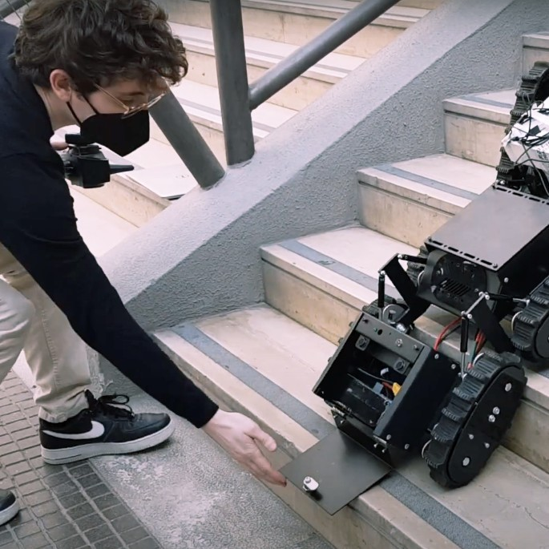

  
  

    <h1 class="title">Germano Pansini</h1>

    

      <a href="https://github.com/Germano-Pansini" target="_blank" rel="noopener" style="display:inline-flex;align-items:center;gap:0.5rem;text-decoration:none;color:var(--color-accent-2);">
        GitHub
      </a>

      <a href="https://www.linkedin.com/in/germano-pansini" target="_blank" rel="noopener" style="display:inline-flex;align-items:center;gap:0.5rem;text-decoration:none;color:var(--color-accent-2);">
        LinkedIn
      </a>

      <a href="mailto:germano.pansini@gmail.com" style="display:inline-flex;align-items:center;gap:0.5rem;text-decoration:none;color:var(--color-accent-2);">
        Email
      </a>
    

  

I am an engineer with a **B.Sc. in Electronics and Telecommunications Engineering** and an **M.Sc. in Computer Engineering (AI & Data Science)** from the Polytechnic University of Bari.

My work sits at the intersection of **computer vision, robotic perception, embedded systems, and simulation-driven development**. I focus on building end-to-end systems where sensing, learning, and decision-making operate on real platforms under practical constraints (latency, robustness, real-world noise).

**Core interests**
- **Computer Vision & Perception:** object detection, semantic segmentation, video analytics, real-world datasets
- **Robotics:** ROS/ROS2 perception stacks, LiDAR/RGB-D integration, SLAM, sensor fusion, remote teleoperation
- **Embedded & Edge AI:** on-device deployment (Raspberry Pi / Jetson), real-time inference and monitoring
- **Simulation & Digital Twins:** NVIDIA Omniverse / Isaac Sim, OpenUSD pipelines

## Selected Work

  

    <h3>TRAPScore — Pest Object Detection on Edge Platforms</h3>
    

      Developed a pest object-detection pipeline for in-field monitoring: dataset curation/versioning, training and validation of YOLOv8 models for insect detection and counting, and spatio-temporal analysis. Deployed real-time inference on Raspberry Pi stations with OpenCV pre/post-processing and monitoring/reporting tooling.
    

    

      <a href="https://universe.roboflow.com/dacus-xksjc/bactrocera-oleae-detection/dataset/12" target="_blank" rel="noopener">Dataset (Roboflow)</a>
      <a href="https://doi.org/10.1109/IHTC61819.2024.10855066" target="_blank" rel="noopener">Related Publication (DOI)</a>
    

  

  

    <h3>Tracked Rover — Remote Navigation & Real-Time 3D Mapping</h3>
    

      Brought up a tracked rover from mechanics-only base to an operational system: power architecture, LiPo charging, motor control (Sabertooth 2x60), onboard compute, LiDAR/RGB-D integration, wiring/debugging. Implemented a ROS-based autonomy stack with LiDAR SLAM, sonar obstacle detection, and secure remote teleoperation (joystick + RGB streaming).
    

    

      <a href="assets/pdf/makerfaire_2024_certificate.pdf" target="_blank" rel="noopener">Maker Faire Certificate (PDF)</a>
      <a href="assets/pdf/thesis_bsc_autonomous_robot_navigation.pdf" target="_blank" rel="noopener">B.Sc. Thesis (PDF)</a>
    

  

  

    <h3>Neuro-Symbolic Semantic Segmentation for Space Robotics</h3>
    

      Built an end-to-end lunar digital-twin pipeline combining SegFormer-based semantic segmentation with description-logic reasoning to derive navigation-oriented safety cues. Integrated an ontology-driven layer (OWL2/Protégé) and exported simulation-ready assets into NVIDIA Omniverse / Isaac Sim workflows.
    

    

      <a href="assets/pdf/thesis_msc_neuro_symbolic_segmentation.pdf" target="_blank" rel="noopener">M.Sc. Thesis (PDF)</a>
      <a href="https://github.com/Germano-Pansini/Neuro-Symbolic-Semantic-Segmentation-Framework-for-Autonomous-SpaceExploration" target="_blank" rel="noopener">Code (GitHub)</a>
    

  

  

    <h3>Maker Faire Rome 2024 — Winner & Research Presenter</h3>
    

      Demonstrated two applied robotics systems: a vision-driven drone control stack under low-latency constraints and a tracked rover for remote navigation and real-time 3D mapping (ROS + LiDAR SLAM). Supporting material (posters, photos, and demos) is hosted in this portfolio.
    

    

      <a href="assets/images/makerfaire_2024_drone_poster.png" target="_blank" rel="noopener">Drone Poster</a>
      <a href="assets/images/makerfaire_2024_rover_poster.png" target="_blank" rel="noopener">Rover Poster</a>
    

  

## Demos

### Drone — Vision-Based Gesture Control (local video)
If you uploaded the MP4 under `docs/assets/videos/`, it will play here.

<video controls preload="metadata" style="width:100%;max-width:720px;border-radius:12px;border:1px solid var(--color-border);">
  <source src="assets/videos/drone_gesture_control.mp4" type="video/mp4">
</video>

### Tracked Rover — Mapping / SLAM (local video)
<video controls preload="metadata" style="width:100%;max-width:720px;border-radius:12px;border:1px solid var(--color-border);margin-top:1rem;">
  <source src="assets/videos/tracked_rover_mapping.mp4" type="video/mp4">
</video>
