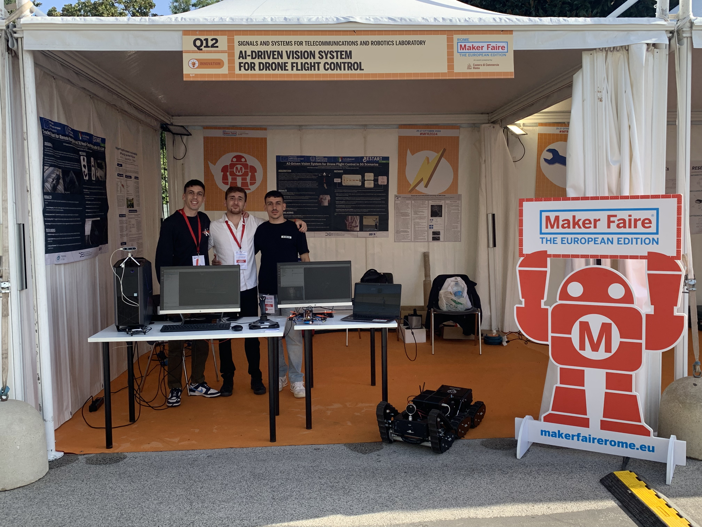
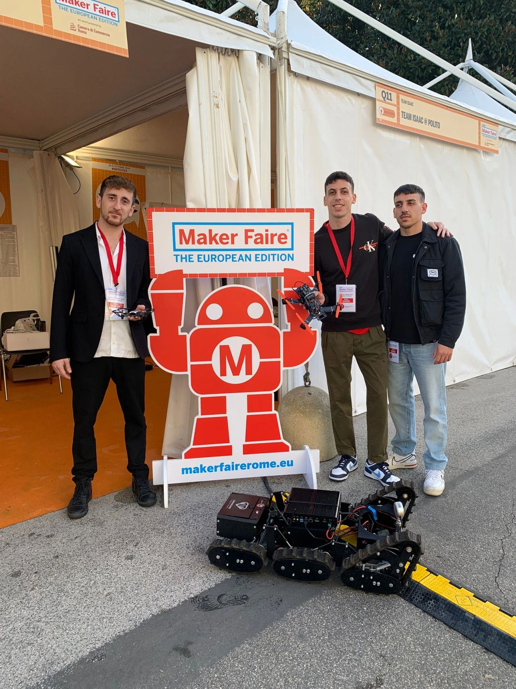
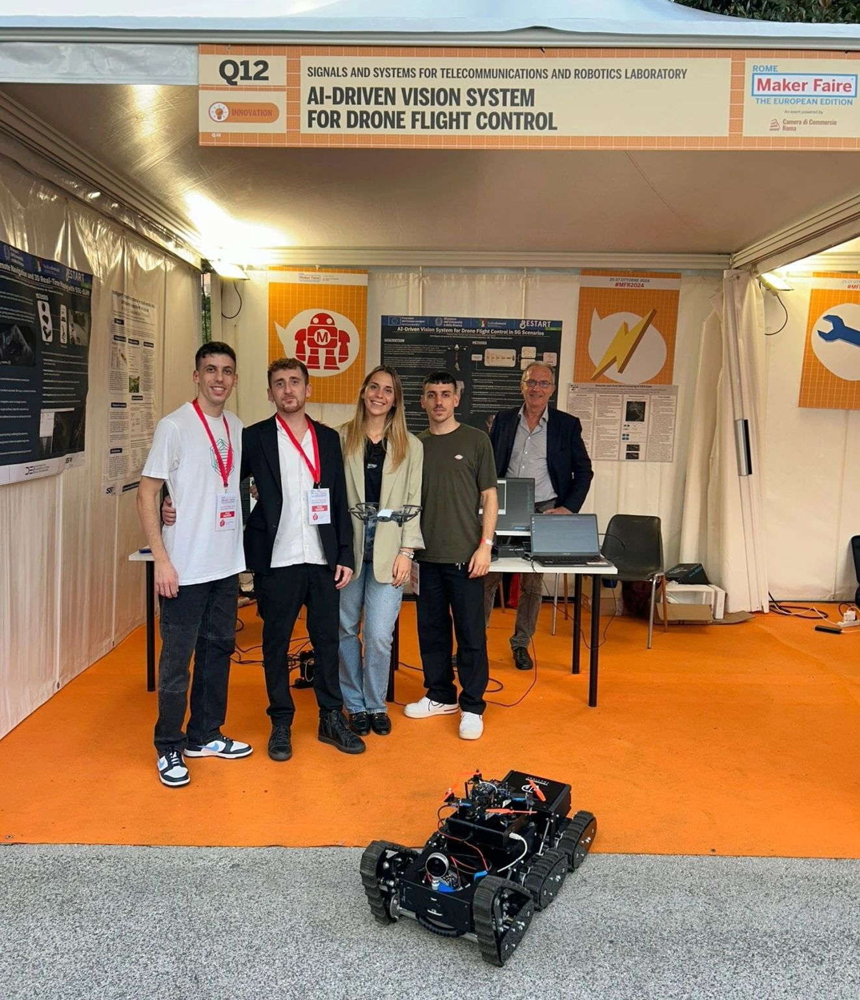

  

  

    <h1 class="title">Hi, I'm Germano!</h1>

    

      <!-- socials invariati -->
    

  

<!-- ===== PHOTOS (moved from Media) ===== -->

  

    
  

  

    
  

  

    
  

I’m passionate about **autonomous robotics** and enjoy building robots and drones that interact with the physical world.  
I like working end-to-end, combining **hands-on hardware work** (electronics, wiring, sensor integration) with **software development** for perception, control, and autonomy.

My interests focus on **robotics perception and computer vision**, from data collection and model training to deployment on real robotic platforms.  
I mainly work in **Linux/Ubuntu environments**, using **ROS/ROS2** and computer vision libraries to build practical systems such as vision-driven drones and tracked rovers, with strong attention to real-time behavior, robustness, and system integration.

…
