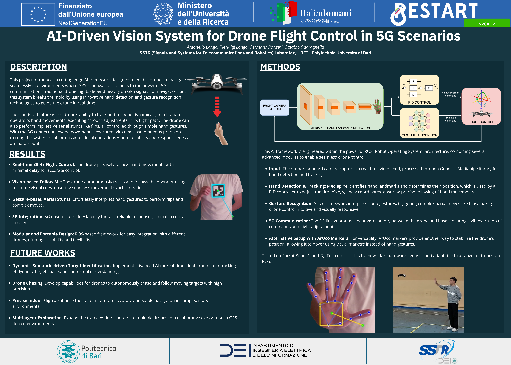
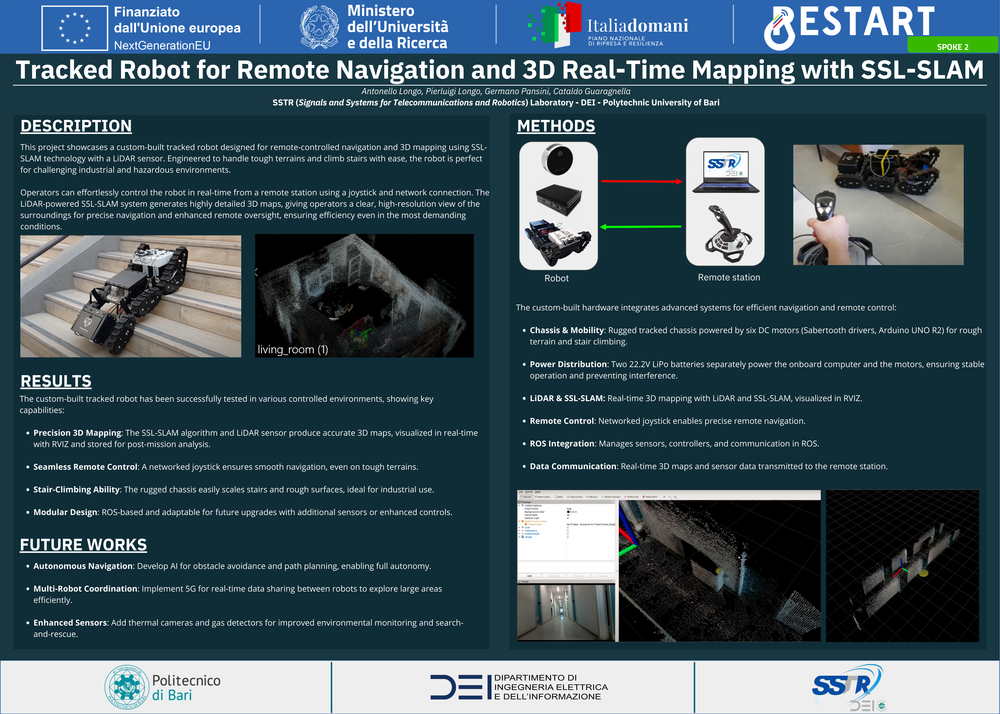

<!-- docs/media.md -->
# Media

  Selected demos and visual material showcasing deployed systems and real-world experiments.

 

## Maker Faire Rome 2024 — Robotics Demos

### Vision-Driven Drone Control (Gesture / Low-Latency)

  

    
  

  

    <video controls preload="metadata"
           style="width:100%; border-radius:16px;">
      <source src="assets/videos/drone_gesture_control.mp4" type="video/mp4">
      <source src="videos/drone_gesture_control.mp4" type="video/mp4">
      Your browser does not support the video tag.
    </video>
  

  

    <strong>Continuous Gesture-Based Flight Control.</strong> 
    Real-time hand landmark tracking (MediaPipe) mapped to drone pose commands,
    enabling smooth PID-stabilized motion under ultra-low latency constraints.
  

  

    <video controls preload="metadata"
           style="width:100%; border-radius:16px;">
      <source src="assets/videos/drone_gesture_control_2.mp4" type="video/mp4">
      <source src="videos/drone_gesture_control_2.mp4" type="video/mp4">
      Your browser does not support the video tag.
    </video>
  

  

    <strong>Gesture-Triggered Aerial Maneuvers.</strong> 
    Discrete hand gestures interpreted by a neural model to trigger high-level
    flight actions (mode switches, rotations, flips) on top of the same vision pipeline.
  

 

### Tracked Rover — Remote Navigation & Real-Time 3D Mapping (ROS + LiDAR SLAM)

  

    
  

  

    YouTube demos:
  

  

    
    

      

        <iframe
          src="https://www.youtube-nocookie.com/embed/MevmB0SO3JE"
          title="Tracked rover demo 1"
          loading="lazy"
          allow="accelerometer; autoplay; clipboard-write; encrypted-media; gyroscope; picture-in-picture; web-share"
          allowfullscreen
          style="position:absolute; inset:0; width:100%; height:100%; border:0;">
        </iframe>
      

      
Tracked rover demo — navigation and mapping

    

    

      

        <iframe
          src="https://www.youtube-nocookie.com/embed/FkRZWmPqa9c"
          title="Tracked rover demo 2"
          loading="lazy"
          allow="accelerometer; autoplay; clipboard-write; encrypted-media; gyroscope; picture-in-picture; web-share"
          allowfullscreen
          style="position:absolute; inset:0; width:100%; height:100%; border:0;">
        </iframe>
      

      
Tracked rover demo — SLAM and teleoperation

    

  

 

## Photos

  

    
    
    
  

