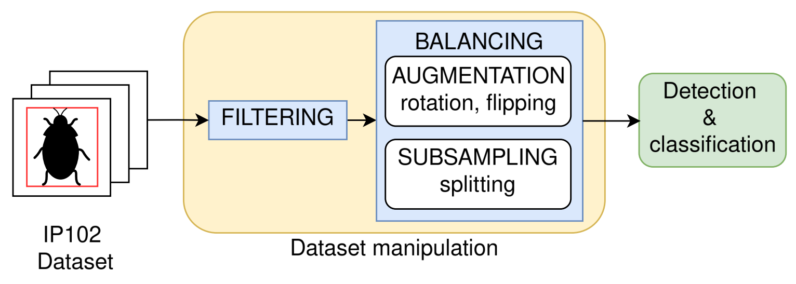

# Publications

  

    

    

      

        
          Crop Monitoring via Deep-Learning-Based Pest Classification for Pesticide Reduction
        
        2024
      

      

        IEEE International Humanitarian Technologies Conference (IHTC)
      

      

        

          
        

        <strong>Authors:</strong> 
        Antonello Longo, Maria Rizzi, Pierluigi Longo, Germano Pansini, Cataldo Guaragnella
          

        This work proposes and evaluates a real-time deep-learning approach for multi-class pest detection,
        addressing class imbalance and intra-class variability. The method is validated on the IP102 dataset
        and demonstrates improved precision and F1 scores over YOLO baselines.
          

        <strong>DOI:</strong>
        <a
          href="https://doi.org/10.1109/IHTC61819.2024.10855066"
          class="cactus-link"
          target="_blank"
          rel="noopener">
          10.1109/IHTC61819.2024.10855066
        </a>

      

    

  

